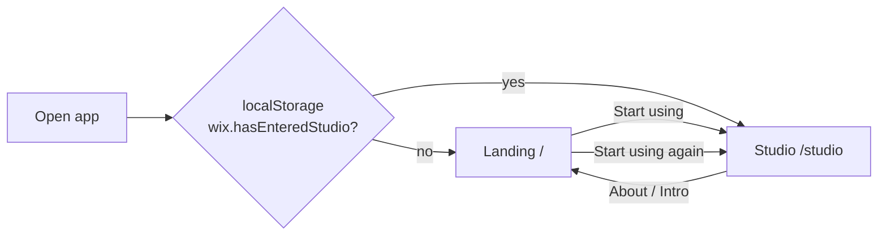

# UI Redesign: Landing Page + Studio + Theme Modes

**Date:** 2026-05-22  
**Status:** Approved (brainstorming) — pending spec file review  
**Scope:** Client-side SPA (React + Vite + PWA + Capacitor Android)

## Goals

1. **Modern, clear, intuitive UI** — reduce cognitive load on the functional screen.
2. **Separate concerns** — marketing and product explanation on a landing page; mixing tools on a dedicated studio page.
3. **No marketing clutter on studio** — capabilities, platforms, and install options live on the landing page only.
4. **First-visit onboarding** — show landing once; remember choice; allow return to landing from studio.
5. **Theme support** — light mode, dark mode, and follow-system; user-selectable with persistence.

## Non-Goals

- Backend, accounts, or cloud sync.
- Changing audio engine behavior or mixer domain logic (unless required for routing/state lift).
- Full design system package or third-party UI library.

## Information Architecture

| Route | Purpose |
|-------|---------|
| `/` | Landing: hero + scroll sections (features, how-to, platforms) |
| `/studio` | Studio: sound picker + mixer only |

**Entry behavior (B):**

- On first visit, user sees `/`.
- Clicking **开始使用** navigates to `/studio` and sets `localStorage` key `wix.hasEnteredStudio = '1'`.
- Subsequent visits: if `wix.hasEnteredStudio` is set, `/` redirects to `/studio` automatically.
- **介绍** from studio navigates to `/` without clearing `wix.hasEnteredStudio` (returning users skip auto-redirect only when they explicitly open landing via the link — see routing note below).

**Routing note:** Auto-redirect from `/` to `/studio` runs only when `hasEnteredStudio` is set **and** the user did not arrive via an explicit “介绍” navigation intent. Implementation options (pick one in plan):

- Query flag: `/` vs `/studio` with `?from=intro` on landing when opened from studio; skip redirect when `from=intro`.
- Or: always allow `/` when navigated client-side from studio; redirect only on cold load of `/` with stored flag.

Recommended: **cold-load redirect only** — client-side navigation from studio to `/` never auto-bounces back.

## Landing Page Content

### Hero

- Product title: **白噪音混音器**
- One-line value proposition (focus/relaxation, layered soundscapes).
- Primary CTA: **开始使用** → `/studio` + set `hasEnteredStudio`.
- No Web Audio / Capacitor / technical stack in hero copy.

### Section 1 — 能做什么

User-facing capabilities (not implementation):

- Layer multiple built-in ambiences and custom imported audio
- Per-layer volume, pan, speed; mute
- Master volume, stereo width, global playback rate
- Local import (MP3, WAV, M4A, etc.) stored on device

### Section 2 — 怎么用

Three steps: 选声音 → 调混音 → 播放. Repeat **开始使用** CTA at section end.

### Section 3 — 使用场景与平台

Explain outcomes in plain language:

- Works in the browser immediately
- Install to home screen for offline-style use (PWA)
- Android app availability

Avoid leading with “APK”, “Capacitor”, or “Web Audio”. Optional footnote or `
` for technical readers.

### Footer (optional)

- Repo link / version string — single line.

## Studio Page Content

### Removed from current home

- Large marketing hero and long platform paragraph
- Four stat cards (内置声景 / 叠加混音 / PWA / APK)
- English marketing eyebrows at large scale

### Studio chrome (~48–56px top bar)

- App mark or short title
- Play / pause
- Import custom audio
- **介绍** → landing `/`
- **Theme control** (see Theme System)

### Studio body

- Keep **sound catalog + mixer console** two-column layout on wide screens (F1).
- Stack columns on narrow viewports via existing responsive patterns.
- Import status: compact inline message (toolbar area or slim banner), not a hero-scale paragraph.

### State preservation

- Mixer state, custom tracks, and `AudioEngine` must survive navigation between landing and studio.
- Lift `App` state to a layout parent above route outlets, or equivalent pattern.

## Theme System

### Modes

| Mode | Behavior |
|------|----------|
| `system` (default) | Follow `prefers-color-scheme`; update live when OS theme changes |
| `light` | Force light palette |
| `dark` | Force dark palette |

### Persistence

- `localStorage` key: `wix.themePreference` = `'system' | 'light' | 'dark'`
- Default: `system` when unset

### Application

- Set `data-theme="light"` or `data-theme="dark"` on `<html>` (resolved effective theme, not preference).
- CSS uses custom properties for colors, borders, shadows, and gradients in both themes.
- `color-scheme: light dark` on `:root` so native controls match effective theme.

### UI control

- **Studio top bar:** compact control (icon button opening a small menu, or three-option segmented control): 跟随系统 / 浅色 / 深色.
- **Landing page:** same control in header or footer so theme is choosable before first studio visit.
- Label in Chinese; `aria-label` describes current effective mode.

### Visual tokens (both themes)

Define semantic tokens (examples):

- `--bg`, `--bg-elevated`, `--text`, `--text-muted`, `--border`, `--accent`, `--accent-gradient`, `--shadow`
- Landing may use slightly more marketing contrast; studio stays utilitarian in both modes.
- Ensure selected sound cards, sliders (`accent-color`), and focus rings meet contrast in **both** themes (WCAG AA target for text).

### PWA / Android

- No separate native theme API required for v1; WebView inherits CSS + `prefers-color-scheme` when preference is `system`.
- Meta `theme-color` may track effective theme (optional enhancement in plan).

## Navigation & Technical Approach

**Recommended:** lightweight client-side routing (e.g. React Router or minimal in-house router).

| Alternative | Verdict |
|-------------|---------|
| View state only, no URL | Rejected — poor refresh/bookmark behavior |
| Hash routing | Fallback only |

## Copy & Language

- Primary UI copy: **Chinese**
- English: minimal (accessibility labels where helpful), no large decorative English eyebrows

## Accessibility

- Landmark regions: `main`, headings `h1`→`h2` hierarchy per page
- Landing CTAs and theme control keyboard-operable
- Preserve `aria-pressed` on sound cards, `aria-label` on file input and sliders

## Testing Expectations (for implementation plan)

- Unit: redirect logic respects `hasEnteredStudio` and explicit landing navigation
- Unit: theme resolver (`system` + mocked `matchMedia`)
- Component: landing CTA sets storage; studio shows mixer without stat grid
- Existing audio/mixer tests remain green

## File Structure (anticipated)

| Path | Responsibility |
|------|----------------|
| `src/pages/LandingPage.tsx` | Marketing sections + CTAs |
| `src/pages/StudioPage.tsx` | Mixer UI (extracted from current `App`) |
| `src/layout/AppLayout.tsx` | Shared state, engine, route outlet |
| `src/theme/ThemeProvider.tsx` | Preference storage, system listener, `data-theme` |
| `src/theme/tokens.css` | Light/dark CSS variables |
| `src/router.tsx` or `src/main.tsx` | Route definitions |
| `src/App.css` | Split or renamed; consume tokens |

## Decisions Log

| Decision | Choice |
|----------|--------|
| First visit | Landing only once (`hasEnteredStudio`) |
| Capabilities / platforms | All on landing (scroll sections) |
| Studio layout | F1: slim top bar + dual column |
| Routing | Client-side `/` and `/studio` |
| Theme | light / dark / system + localStorage |

## Approval

- IA (section 1): **Approved**
- Landing, studio, copy, routing: **Approved**
- Theme (light / dark / system): **Approved** (2026-05-22)
